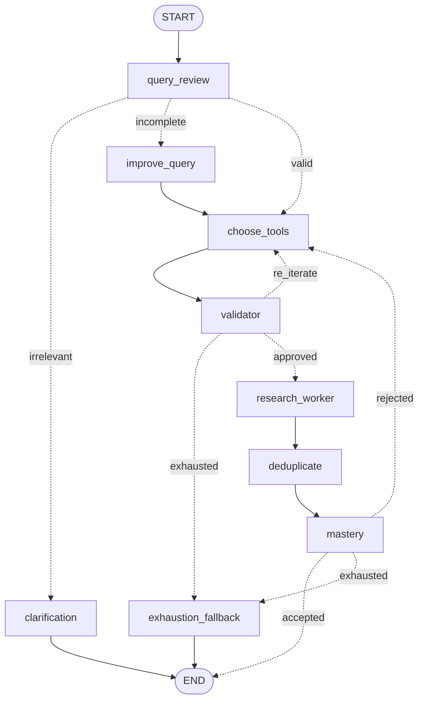

# Autonomous Research Agent

This project implements a simple autonomous research agent using the OpenAI ecosystem and LangGraph. It accepts a user query, decides whether the query is usable, chooses research tools, gathers evidence from external sources through Tavily search, removes duplicates, and produces a structured final summary.

## What this project does

- Accepts a user topic or query
- Uses LLM reasoning for query review, tool choice, validation, and synthesis
- Searches external sources through Tavily's search API
- Deduplicates overlapping evidence with a non-LLM heuristic
- Produces:
  - Key points
  - Important findings
  - References
  - Actionable insights when applicable

## Architecture

The workflow follows this plan:



1. Query review
2. Query improvement when needed
3. Tool selection
4. Validator loop
5. Parallel research workers
6. Deduplication
7. Mastery synthesis
8. Exhaustion fallback if the retry budget is spent

## Project structure

```text
src-layout project root
├── src/autonomous_research_agent/
├── venv/
├── .env
├── pyproject.toml
├── requirements.txt
├── streamlit_app.py
└── README.md
```

- `src/autonomous_research_agent/` holds the actual application code.
- `venv/` stays at the project root, not inside `src/`, because it is an environment, not part of the package.
- `.env` also belongs at the project root so config can load cleanly.

Package contents:

```text
src/autonomous_research_agent/
  config.py
  models.py
  prompts.py
  llm.py
  fetchers.py
  dedup.py
  graph.py
  cli.py
requirements.txt
example.env
README.md
streamlit_app.py
```

## Setup

1. **Clone the repository and enter the directory**:
```bash
git clone https://github.com/MohitSinghBisht/Autonomous-Research-Agent.git
cd "Autonomous Research Agent"
```

2. **Create and activate a virtual environment**:
```bash
python3 -m venv venv
source venv/bin/activate  # On Windows use: venv\Scripts\activate
```

3. **Install dependencies**:
```bash
pip install -r requirements.txt
```

4. **Install the project in editable mode**:
```bash
pip install -e .
```

5. **Configure environment variables**:
Copy the example environment file:
```bash
cp example.env .env
```
Then open `.env` and fill in your API keys:
- `OPENAI_API_KEY`: Required for LLM reasoning.
- `TAVILY_API_KEY`: Required for web search capabilities.

6. **Run the Application UI**:
This project provides a web interface for using the application. Start it by running the Streamlit app:
```bash
streamlit run streamlit_app.py
```

## Run CLI

```bash
autonomous-research-agent "latest developments in battery recycling policy in Europe"
```

Optional markdown export:

```bash
autonomous-research-agent "latest developments in battery recycling policy in Europe" --output report.md
```

## Streamlit UI

The project also includes an Arc-inspired search-first Streamlit interface with:

- a centered landing search box
- live node-by-node progress updates
- structured summary rendering
- references and reasoning logs
- local JSONL log inspection in the sidebar

Run it with either of these:

```bash
streamlit run streamlit_app.py
```

or, if you have not installed the package in editable mode:

```bash
PYTHONPATH=src streamlit run streamlit_app.py
```

## State design

The LangGraph state tracks:

- `user_query`
- `available_tool_calls`
- `tried_combinations`
- `proceeded_tool_calls_with_reasoning`
- `mastery_feedback`
- `attempt_count`
- `MAX_ATTEMPTS`
- `low_confidence`
- `raw_results`
- `filtered_results`
- `summary`
- `reasoning_log`

Every LLM node appends a reasoning entry to `reasoning_log`.

## Notes on the architecture

- LLM reasoning is handled through the OpenAI Python SDK (query review, tool selection, validation, synthesis).
- External information gathering uses **Tavily** (`tavily-python`) instead of OpenAI web search.
  - Tavily is purpose-built for LLM/agent use and returns pre-extracted clean text — no additional
    HTML parsing step needed.
  - The three research tools are differentiated entirely through Tavily's native `include_domains`
    parameter and a query suffix, defined as static profiles in `fetchers.py`.
  - `general_web_search` → unrestricted Tavily call.
  - `official_docs_search` → Tavily call restricted to known government and standards-body domains.
  - `expert_analysis_search` → Tavily call restricted to reputable analysis outlets, query nudged
    with `" expert analysis"`.
- The parallel fan-out step uses worker-style tool jobs, not independent autonomous agents with their own tool loops.
- The implementation is intentionally small and readable rather than deeply abstracted.

## Observability

- Terminal progress logs are printed as each graph node starts, finishes, and routes to the next step.
- A local JSONL run log is saved under `logs/` with step-by-step input state, output update, and state-after-node snapshots.
- The Streamlit UI reuses the same logger so progress can be shown live inside the app while the agent runs.
- LangSmith tracing is enabled through:
  - `wrap_openai(...)` around the OpenAI client
  - `@traceable` on the top-level graph run and tool fetch function

Required environment variables for LangSmith:

```bash
LANGSMITH_TRACING=true
LANGSMITH_API_KEY=your_langsmith_key
LANGSMITH_PROJECT=your_project_name
```

If your LangSmith account is outside the default US region, also set `LANGSMITH_ENDPOINT`.

Langsmith example log: https://smith.langchain.com/public/82d8ba7a-c7b7-4206-813d-e55212923521/r/019f2ece-fc8c-7ca1-8e72-b33414337e95

## Deduplication note

Deduplication is the one deliberate non-LLM step. It uses string similarity on titles and content snippets. This is a data hygiene step, not a judgment step.

## Known scope decisions

- Cache-hit routing is not implemented.
- Improved queries are not re-validated through the first node. This is deliberate to avoid recursion loops.
- Clarification is implemented as a simple response path instead of a full `interrupt()` resume workflow.
- Exhaustion fallback returns a best-effort answer marked as low confidence.
